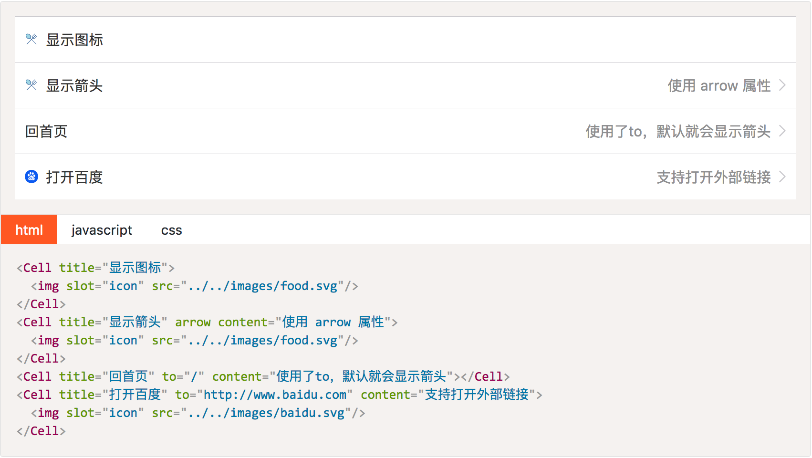

# Smart-UI

High Quality Mobile UI Componets by Vue.js 2.

* [Documentation](https://xiaoyann.github.io/smart-ui/docs)
* [Complete Example](https://xiaoyann.github.io/smart-ui/demo)

## installation

using yarn

```
$ yarn add smart-ui
```

or via npm

```
$ npm install smart-ui --save
```

then apply to vue.js and import `smart-ui.css`


```js
import Vue from 'vue'
import SmartUI from 'smart-ui'
import 'smart-ui/lib/smart-ui.css'
// apply to vue.js
Vue.use(SmartUI)
```

Most of components can be used like this:




